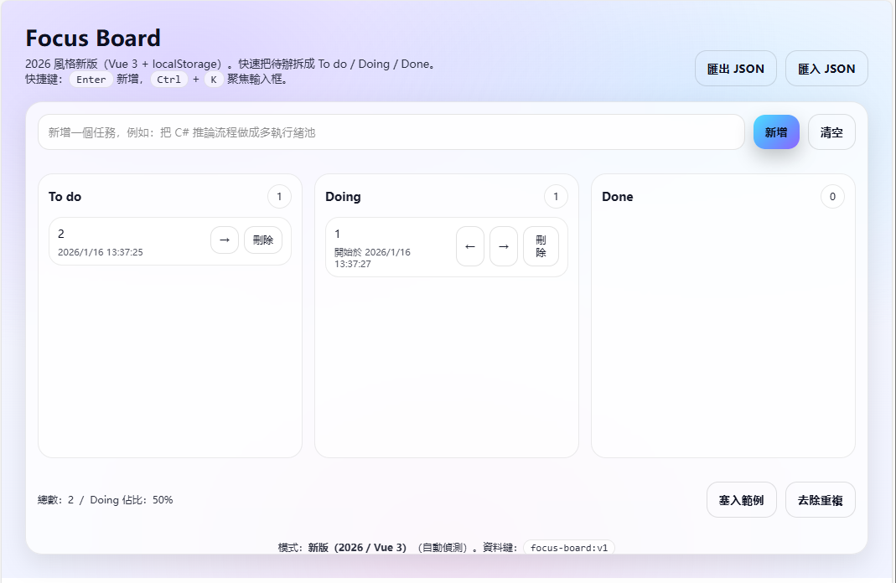
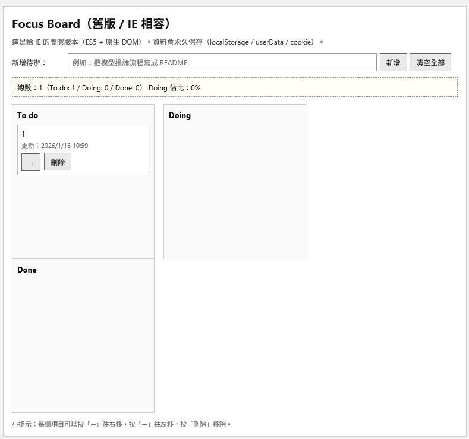

# Focus Board – 雙介面前端示範

一個**單檔前端應用程式**，可自動在以下兩種模式間切換：

- **現代介面（2026 風格）**：適用於現代瀏覽器
- **舊版介面（IE 相容，ES5）**：適用於 Internet Explorer

所有邏輯都在**一個 `index.html`** 中，**無需建置步驟**，無後端，舊版路徑無需依賴。

> [English](README.md) | 繁體中文

---

## ✨ 功能特色

- ✅ 單一 `index.html`，開啟即可執行
- ✅ 自動瀏覽器偵測
  - 現代瀏覽器 → 現代介面
  - Internet Explorer → 舊版介面
- ✅ 兩種模式功能相同
- ✅ 持久化儲存
  - `localStorage`（現代瀏覽器）
  - IE 相容儲存備援（舊版）
- ✅ 現代與舊版程式碼路徑清晰分離

---

## 🧠 設計理念

本專案示範前端應用程式如何：

- 支援**現代框架與語法**
- 同時保持**與舊版企業環境相容**
- 無需複製專案或引入建置流程

特別適用於：
- 企業／工業系統
- 舊版 IE 環境
- 離線或隔離機器
- 示範或訓練用途

---

## 🖥️ 介面模式

### 現代模式
在現代瀏覽器中自動啟用。

- 現代化版面與樣式
- 響應式狀態管理
- 清晰的元件結構
- 2026 風格視覺設計



### 舊版模式
在 Internet Explorer 中自動啟用。

- 僅使用 ES5
- 無框架
- 純 DOM 操作
- 簡潔、乾淨的 2000 年代初期風格介面
- 設計用於配合 IE 安全限制



---

## 📂 專案結構

```text
.
├── index.html          # 完整應用程式（現代 + 舊版）
├── README.md           # 英文文件
└── Readme_zh-tw.md     # 繁體中文文件
```
